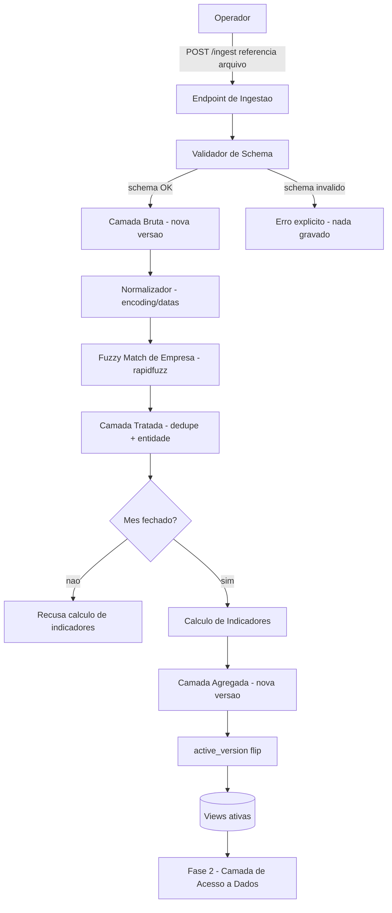

# Ingestão e Curadoria de Dados (Fase 1) Design

**Spec**: `.specs/features/ingestao-curadoria/spec.md`
**Status**: Draft

---

## Architecture Overview

Pipeline batch disparado manualmente via endpoint HTTP (ADR-002), com três camadas de
dados versionadas (bruto → tratado → agregado) armazenadas em `analytics.db` (SQLite).
Cada camada é apenas-adição (append-only): uma execução nunca sobrescreve a anterior, e
um ponteiro de "versão ativa" por camada determina qual versão é servida a
consumidores (Fase 2 — Camada de Acesso a Dados). Isso resolve o requisito de
versionamento/rollback (ING-11) sem exigir modelagem linha-a-linha (SCD2 clássico), que
não se encaixa bem porque a fonte não fornece um `updated_at` confiável por reclamação
— o que existe é um arquivo inteiro re-extraído em lote a cada mês.



---

## Code Reuse Analysis

### Existing Components to Leverage

| Component | Location | How to Use |
| --------- | -------- | ---------- |
| Nenhum    | —        | Projeto greenfield — esta é a primeira feature de código do produto, não há componentes existentes a reusar. |

### Integration Points

| System                          | Integration Method                                                                          |
| -------------------------------- | --------------------------------------------------------------------------------------------- |
| Docker Compose ([ADR-001](../../../docs/adr/001-execucao-local-com-docker-compose.md)) | Pipeline roda como serviço(s) dentro do compose local; endpoint exposto na rede do compose. |
| `analytics.db` ([ADR-002](../../../docs/adr/002-stack-processamento-dados-local.md))   | Único processo escritor = processo de ingestão; as 3 camadas residem neste arquivo.          |
| `app.db` ([ADR-002](../../../docs/adr/002-stack-processamento-dados-local.md))         | Não usado por esta feature — reservado ao agente conversacional (Fase 3).                    |

---

## Components

### Endpoint de Ingestão

- **Purpose**: recebe o disparo manual e inicia uma execução de ingestão.
- **Location**: `app/ingestion/endpoint.py`
- **Interfaces**:
  - `POST /ingest {source_path: str, period: str}` -> `202 {run_id}` - inicia a execução
  - `GET /ingest/{run_id}` -> `{status, row_count, error_message}` - consulta status
- **Dependencies**: Validador de Schema, gravação em `ingestion_runs`
- **Reuses**: nenhum (novo)

### Validador de Schema

- **Purpose**: garante que o CSV recebido tem exatamente as colunas esperadas antes de
  gravar qualquer dado.
- **Location**: `app/ingestion/schema_validator.py`
- **Interfaces**:
  - `validate(csv_path: str) -> SchemaValidationResult` - OK ou lista de colunas divergentes
- **Dependencies**: definição de schema esperado (config/const)
- **Reuses**: nenhum

### Camada Bruta (writer)

- **Purpose**: grava o CSV sem alteração como nova versão, com metadados de execução.
- **Location**: `app/ingestion/raw_layer.py`
- **Interfaces**:
  - `store_raw(csv_path: str, run_id: int) -> int` (retorna `version_id`)
- **Dependencies**: `ingestion_runs`, `dataset_versions`
- **Reuses**: nenhum

### Normalizador

- **Purpose**: padroniza encoding e formato de data antes da etapa de fuzzy match.
- **Location**: `app/curation/normalizer.py`
- **Interfaces**:
  - `normalize(raw_rows: Iterable[dict]) -> Iterable[dict]`
- **Dependencies**: nenhuma externa
- **Reuses**: nenhum

### Módulo de Fuzzy Match de Empresa

- **Purpose**: agrupa nomes de empresa distintos-porém-similares como a mesma entidade,
  sinalizando pares ambíguos para revisão amostral (ING-07).
- **Location**: `app/curation/company_matcher.py`
- **Interfaces**:
  - `match_companies(names: list[str]) -> MatchResult` (`merged_groups`, `review_queue`)
- **Dependencies**: `rapidfuzz`
- **Reuses**: nenhum

### Camada Tratada (writer)

- **Purpose**: grava os dados normalizados/deduplicados como nova versão vinculada à
  versão bruta de origem.
- **Location**: `app/curation/treated_layer.py`
- **Interfaces**:
  - `store_treated(normalized_rows: Iterable[dict], source_version_id: int) -> int`
- **Dependencies**: `dataset_versions`
- **Reuses**: nenhum

### Calculador de Indicadores

- **Purpose**: calcula índice de solução (oficial/estrito), tempo médio de resposta e
  nota média, por empresa/segmento/mês, apenas para meses fechados.
- **Location**: `app/aggregation/indicators.py`
- **Interfaces**:
  - `is_month_closed(period: str) -> bool`
  - `calculate(treated_version_id: int, period: str) -> int` (retorna `version_id` agregado)
- **Dependencies**: Camada Tratada
- **Reuses**: nenhum

### Gerenciador de Versão/Rollback

- **Purpose**: gerencia o ponteiro `active_version` por camada e permite reverter.
- **Location**: `app/db/version_manager.py`
- **Interfaces**:
  - `activate(layer: str, version_id: int) -> None`
  - `get_active(layer: str) -> int`
  - `rollback(layer: str, version_id: int) -> None` (alias de `activate` para versão anterior)
- **Dependencies**: `active_version`
- **Reuses**: nenhum

---

## Data Models (if applicable)

> Usando DDL SQL em vez de interfaces tipadas — stack é Python + SQLite (ADR-002).

### Controle de execuções e versionamento

```sql
-- Ledger de execucoes de ingestao
CREATE TABLE ingestion_runs (
    run_id INTEGER PRIMARY KEY AUTOINCREMENT,
    started_at TEXT NOT NULL,
    finished_at TEXT,
    status TEXT NOT NULL CHECK (status IN ('running','success','failed')),
    source_file_name TEXT NOT NULL,
    source_checksum TEXT NOT NULL,
    row_count INTEGER,
    error_message TEXT
);

-- Versoes por camada (bruto/tratado/agregado)
CREATE TABLE dataset_versions (
    version_id INTEGER PRIMARY KEY AUTOINCREMENT,
    layer TEXT NOT NULL CHECK (layer IN ('bruto','tratado','agregado')),
    source_run_id INTEGER REFERENCES ingestion_runs(run_id),
    source_version_id INTEGER REFERENCES dataset_versions(version_id),
    created_at TEXT NOT NULL,
    row_count INTEGER NOT NULL,
    status TEXT NOT NULL CHECK (status IN ('building','ready','failed'))
);

-- Ponteiro de versao ativa por camada
CREATE TABLE active_version (
    layer TEXT PRIMARY KEY CHECK (layer IN ('bruto','tratado','agregado')),
    version_id INTEGER NOT NULL REFERENCES dataset_versions(version_id),
    activated_at TEXT NOT NULL,
    activated_by TEXT NOT NULL
);
```

**Relationships**: `ingestion_runs` (1) → `dataset_versions` (N, `layer='bruto'`) via
`source_run_id`; `dataset_versions` encadeia bruto → tratado → agregado via
`source_version_id` (lineage); `active_version` aponta para exatamente uma linha de
`dataset_versions` por `layer`.

### Camadas de fato

```sql
-- Copia fiel do CSV oficial, sem transformacao (colunas de dominio conforme spec.md
-- Assumptions - a confirmar quando dados.mj.gov.br voltar, ver Risks & Concerns)
CREATE TABLE bruto_reclamacoes (
    version_id INTEGER NOT NULL REFERENCES dataset_versions(version_id),
    empresa_nome_raw TEXT,
    segmento TEXT,
    assunto TEXT,
    uf TEXT,
    data_abertura TEXT,
    data_resposta TEXT,
    resultado TEXT,
    nota_satisfacao REAL
);

-- Dados normalizados e deduplicados
CREATE TABLE tratado_reclamacoes (
    version_id INTEGER NOT NULL REFERENCES dataset_versions(version_id),
    empresa_entidade_id INTEGER NOT NULL, -- resultado do fuzzy match
    segmento TEXT NOT NULL,
    assunto TEXT,
    uf TEXT,
    data_abertura TEXT NOT NULL,
    data_resposta TEXT,
    resultado TEXT NOT NULL,
    nota_satisfacao REAL
);

-- Indicadores agregados, apenas mes fechado
CREATE TABLE agregado_indicadores_mensais (
    version_id INTEGER NOT NULL REFERENCES dataset_versions(version_id),
    empresa_entidade_id INTEGER NOT NULL,
    segmento TEXT NOT NULL,
    periodo TEXT NOT NULL, -- mes fechado, formato YYYY-MM
    indice_solucao_oficial REAL NOT NULL,
    indice_solucao_estrito REAL NOT NULL,
    tempo_medio_resposta REAL NOT NULL,
    nota_media REAL,
    UNIQUE (version_id, empresa_entidade_id, segmento, periodo)
);

-- View que a Camada de Acesso a Dados (Fase 2) deve consultar - nunca a tabela de fato
CREATE VIEW agregado_indicadores_ativo AS
SELECT f.*
FROM agregado_indicadores_mensais f
JOIN active_version av ON av.layer = 'agregado' AND av.version_id = f.version_id;
```

**Relationships**: cada linha de fato referencia um `version_id`; a view
`agregado_indicadores_ativo` (e equivalentes para bruto/tratado, se necessário) resolve
transparentemente para a versão marcada como ativa, isolando consumidores do conceito
de versionamento.

---

## Error Handling Strategy

| Error Scenario                                                      | Handling                                                                                          | User Impact                                                                     |
| ---------------------------------------------------------------------- | ----------------------------------------------------------------------------------------------------- | ------------------------------------------------------------------------------------ |
| CSV com coluna divergente (ING-02)                                     | Validador rejeita antes de qualquer escrita; `ingestion_runs.status='failed'` com `error_message` citando a(s) coluna(s) | Erro explícito no endpoint identificando a(s) coluna(s); nenhuma versão nova criada  |
| CSV vazio/corrompido (não parseável)                                    | Falha no parse antes da validação de schema; mesmo tratamento acima                                     | Erro explícito distinguindo "arquivo corrompido" de "schema inválido"               |
| Fonte oficial indisponível ao operador (antes de chamar o endpoint)     | Fora do processo — endpoint só recebe referência a arquivo já local (ver Tech Decisions)                | N/A ao sistema; risco documentado abaixo                                            |
| Match fuzzy ambíguo (score 80-91)                                       | Mantido como entidades separadas + adicionado à fila de revisão amostral (ING-07)                       | Nenhuma fusão incorreta automática; revisão humana decide depois                    |
| Reingestão do mesmo período                                             | Tratado como nova versão da camada bruta, nunca sobrescreve                                             | Histórico preservado; versão anterior segue consultável até novo `active_version` flip |
| Cálculo de indicadores solicitado para mês corrente (não fechado)       | `is_month_closed` retorna falso; cálculo recusado antes de gravar                                       | Erro explícito "mês ainda não fechado"                                              |
| Crash no meio de uma execução                                           | `ingestion_runs.status='running'` detectável no próximo boot; versão associada fica `dataset_versions.status='building'`, nunca vira ativa | Falha visível; versão anterior continua ativa e servindo consultas                  |

---

## Risks & Concerns

| Concern                                                                            | Location (file:line)                                     | Impact                                                                | Mitigation                                                                                                                                    |
| --------------------------------------------------------------------------------- | ---------------------------------------------------------- | ------------------------------------------------------------------------ | -------------------------------------------------------------------------------------------------------------------------------------------- |
| Fuzzy match confunde matriz com filial (mesma razão social, CNPJ diferente)         | `app/curation/company_matcher.py` (a criar)                 | Indicador de uma filial contaminado pelos dados de outra                 | Se o CSV trouxer CNPJ, priorizar CNPJ (raiz) sobre nome; nome fuzzy só como fallback — confirmar quando o layout real do CSV for conhecido    |
| Custo O(n²) do fuzzy match sem blocking, com milhares de empresas/mês               | `app/curation/company_matcher.py` (a criar)                 | Tempo de execução da ingestão cresce de forma não linear                 | Aplicar chave de blocking (primeira palavra normalizada) antes do fuzzy match completo com `rapidfuzz.process.cdist`                          |
| Nomes curtos/genéricos inflam score de similaridade                                 | `app/curation/company_matcher.py` (a criar)                 | Falso positivo de merge entre empresas diferentes                        | Threshold conservador (≥92 merge automático) e fila de revisão para 80-91                                                                     |
| Layout exato de colunas do CSV oficial não confirmado (fonte fora do ar desde 2026-07-26) | `.specs/features/ingestao-curadoria/spec.md` (Assumptions)  | Validador de schema (ING-02) e tabelas de fato podem precisar de ajuste   | Já registrado como suposição no spec.md; revisar ING-02 e as colunas acima assim que dados.mj.gov.br voltar, antes de considerar "Verified"    |
| Checkpoint starvation do SQLite em WAL com leitores de longa duração                | `app/db/` (a criar)                                         | Arquivo WAL cresce sem limite, degradando performance de leitura/escrita  | Consumidores (Fase 2) devem manter transações de leitura curtas; ingestão usa `busy_timeout`                                                  |
| Transação grande demais durante a carga da camada bruta                            | `app/ingestion/raw_layer.py` (a criar)                      | Uso de memória elevado/travamento em arquivos mensais grandes            | Gravar em lotes (chunks) durante a carga; "flip" do `active_version` como transação final pequena e separada, só após validar `row_count`      |

---

## Tech Decisions (only non-obvious ones)

| Decision                              | Choice                                                                                       | Rationale                                                                                                              |
| ---------------------------------------- | ------------------------------------------------------------------------------------------------ | ---------------------------------------------------------------------------------------------------------------------- |
| Biblioteca de fuzzy match (ING-05)        | `rapidfuzz`                                                                                       | Mais rápida e ativamente mantida que `thefuzz` (wrapper fino sobre ela); MIT; não exige treino supervisionado como `dedupe` |
| Threshold de fuzzy match                  | ≥92 merge automático / 80-91 fila de revisão / <80 entidades distintas                          | Conservador o suficiente para reduzir falso-positivo em nomes curtos/genéricos, mantendo ING-07 útil                    |
| Ponteiro de versão ativa                  | Tabela `active_version` separada (não flag `is_active` por linha)                                | Rollback vira 1 UPDATE atômico; elimina risco de duas versões "ativas" simultâneas; mais simples de auditar             |
| Payload do endpoint de ingestão           | Referência a arquivo já disponível em volume compartilhado do Docker Compose (não upload multipart) | Uso local single-operator não justifica lidar com upload HTTP de arquivos grandes; simplifica o endpoint                |
| Modo do SQLite                            | WAL (`journal_mode=WAL`) + `busy_timeout`                                                         | Permite Fase 2 (DAL) ler enquanto a ingestão escreve, sem bloqueio mútuo                                                |

> **Project-level decision:** o padrão de versionamento (`dataset_versions` +
> `active_version` + views resolvendo a versão ativa) é consumido diretamente pela Fase
> 2 (Camada de Acesso a Dados), portanto foi apendado como **AD-003** em
> `.specs/STATE.md`. As demais decisões acima são feature-locais.
