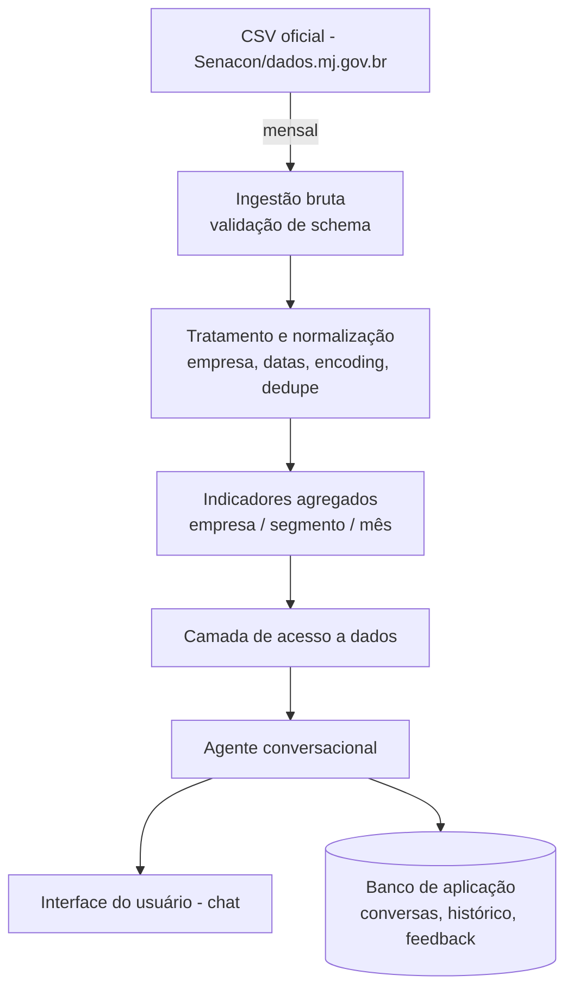

# TDD - Radar Consumidor

| Campo            | Valor                                                  |
| ---------------- | ------------------------------------------------------- |
| Tech Lead        | @Kaue                                                    |
| Product Manager  | -                                                        |
| Time             | Kaue                                                     |
| Epic/Ticket      | -                                                        |
| Figma/Design     | -                                                        |
| Status           | Draft                                                    |
| Criado em        | 2026-07-26                                               |
| Última atualização | 2026-07-26                                             |

---

## Contexto

O Consumidor.gov.br (plataforma da Senacon) publica como dados abertos milhões de
reclamações de consumo finalizadas, com empresa, segmento, assunto, prazos e resultado
do atendimento. É uma medida pública e comparável de qualidade de atendimento, mas hoje
inacessível na prática: responder algo como "quais empresas do meu setor pioraram o
atendimento no trimestre?" exige baixar arquivos, tratar inconsistências (nomes de
empresa não padronizados, encoding, datas), escolher uma metodologia de cálculo e
cruzar períodos manualmente — trabalho de analista medido em dias, sem reprodutibilidade
entre pessoas diferentes.

**Background**: produto novo (greenfield), construído sobre uma base de dados públicos
que já existe e cresce mensalmente, sem que hoje exista uma camada de acesso para quem
não tem competência analítica para explorá-la.

**Domínio**: qualidade de atendimento ao consumidor / dados abertos governamentais.

**Stakeholders**: ouvidoria, qualidade, produto, jornalismo de dados e defesa do
consumidor — perfis que precisam da resposta, não do dado bruto.

---

## Definição do Problema e Motivação

### Problemas que estamos resolvendo

- **Acesso à informação**: a resposta a perguntas de qualidade de atendimento existe nos
  dados, mas exige dias de trabalho analítico (download, tratamento, cálculo, cruzamento
  de períodos) para ser extraída.
  - Impacto: trabalho repetido do zero a cada pergunta, sem reprodutibilidade entre
    pessoas diferentes.
- **Procedência do dado**: decisões são tomadas hoje com números cuja metodologia de
  cálculo não é explicitada, incluindo o fato de que o índice de solução oficial é
  publicamente contestado (conta reclamação não avaliada como resolvida).
  - Impacto: perda de confiança no dado público e risco de decisão de negócio (ou de
    defesa do consumidor) tomada às cegas.

### Por que agora?

- A base de dados já existe e cresce mês a mês sem que ninguém fora de um time técnico
  consiga explorá-la.
- A própria metodologia oficial do índice de solução é publicamente contestada, o que
  exige que qualquer resposta declare explicitamente qual critério foi usado — isso não
  existe em nenhuma ferramenta hoje.

### Impacto de NÃO resolver

- **Negócio/Sociedade**: a pergunta simplesmente deixa de ser feita, ou é respondida com
  números não rastreáveis e não reprodutíveis.
- **Técnico**: cada mês sem essa camada é retrabalho analítico acumulado.
- **Usuários**: perda de confiança no dado público e decisões tomadas sem evidência
  auditável.

---

## Escopo

### ✅ Escopo (V1 - MVP)

- Ingestão dos dados abertos de reclamações finalizadas do Consumidor.gov.br (histórico
  inicial + atualização periódica, sem necessidade de tempo real).
- Indicadores por empresa e por segmento: índice de solução (metodologia oficial e
  metodologia estrita), tempo médio de resposta e nota média de satisfação.
- Recortes por empresa, segmento, assunto/problema, UF e período.
- Comparação entre empresas de um mesmo segmento em um período.
- Evolução de um indicador de uma empresa ao longo do tempo.
- Identificação de empresas com melhora ou piora relevante entre dois períodos.
- Acesso ao texto das reclamações como evidência por trás de um número agregado.
- Toda resposta numérica declara explicitamente qual metodologia de cálculo foi usada.
- Interface de pergunta em linguagem natural para usuário não técnico.

### ❌ Fora do Escopo (V1 → V2+)

- Previsão ou recomendação de ação ("o que a empresa deveria fazer").
- Outras fontes de dado (Reclame Aqui, redes sociais, Procons estaduais).
- Dados pessoais de consumidores ou qualquer dado não anonimizado.
- Atualização em tempo real da base.
- Alertas proativos (ex.: notificar quando uma empresa piora).
- Exportação/relatórios agendados.
- Multiusuário com permissões diferenciadas, histórico compartilhado entre usuários.
- Qualquer escrita ou interação de volta com a plataforma oficial do Consumidor.gov.br.
- Comparação normalizada por porte de empresa (ajuste estatístico para volume de
  reclamações).

> **Nota para revisão**: a comparação por porte ficou fora da V1 de propósito — comparar
> uma empresa pequena com uma gigante do setor sem esse ajuste é um risco (ver seção
> Riscos), então a V1 deve deixar claro na resposta que a comparação é bruta, não
> normalizada.

### 🔮 Considerações Futuras (V2+)

- Normalização estatística por porte de empresa.
- Outras fontes de dado e alertas proativos.
- Multiusuário com histórico compartilhado.

---

## Solução Técnica

### Visão Geral da Arquitetura

**Fonte de dados**: dados abertos de reclamações finalizadas do Consumidor.gov.br
(dados.mj.gov.br), publicados em CSV e atualizados periodicamente pela Senacon. É uma
fonte externa, fora do nosso controle — schema e periodicidade podem mudar sem aviso.

**Principais Componentes**:

- **Rotinas de ingestão e curadoria**: processo em camadas (bruto → tratado →
  agregado). Ingere os CSVs sem alteração, normaliza (empresa, datas, encoding,
  deduplicação) e calcula os indicadores mensais por empresa/segmento/assunto,
  incluindo as duas metodologias de índice de solução. Roda periodicamente e valida o
  schema de entrada antes de processar.
- **Camada de acesso a dados**: serviço que expõe os dados tratados por meio de
  operações específicas (ranking por período, série histórica de uma empresa,
  principais problemas, comparação entre empresas, busca de relatos), em vez de acesso
  direto ao banco. É a única porta de entrada às tabelas agregadas.
- **Agente conversacional**: recebe a pergunta em linguagem natural, decide quais
  operações da camada de dados chamar, monta a resposta e obrigatoriamente declara qual
  metodologia foi usada no número apresentado.
- **Banco de aplicação**: armazena estado da interação (conversas, histórico, feedback
  do usuário), separado dos dados analíticos.
- **Interface do usuário**: chat onde a pergunta é feita e a resposta (texto +
  indicadores) é exibida, com filtros de segmento/período.

**Diagrama de Arquitetura**:

### Fluxo de Dados

1. CSV oficial é publicado mensalmente pela Senacon.
2. Ingestão bruta valida o schema de entrada antes de aceitar o arquivo.
3. Etapa de tratamento normaliza nomes de empresa, datas, encoding e remove duplicatas.
4. Indicadores agregados são calculados por empresa/segmento/mês, nas duas metodologias
   de índice de solução.
5. Camada de acesso a dados expõe operações específicas sobre os dados agregados.
6. Agente conversacional interpreta a pergunta, chama as operações necessárias e monta
   a resposta, declarando a metodologia usada.
7. Interface do usuário exibe a resposta (texto + indicadores) com filtros aplicáveis.

### Operações da Camada de Acesso a Dados

| Operação                         | Descrição                                                        |
| --------------------------------- | ------------------------------------------------------------------ |
| Ranking por período               | Lista empresas de um segmento ordenadas por indicador em um período |
| Série histórica de uma empresa    | Evolução de um indicador de uma empresa ao longo do tempo           |
| Principais problemas              | Assuntos/problemas mais frequentes por empresa ou segmento          |
| Comparação entre empresas         | Compara indicadores de duas ou mais empresas em um mesmo período    |
| Busca de relatos                  | Retorna texto de reclamações como evidência de um número agregado   |
| Detecção de variação relevante    | Identifica empresas com melhora/piora entre dois períodos           |

> Todas as operações retornam, junto ao dado, qual metodologia de cálculo (oficial ou
> estrita) foi utilizada.

### Mudanças de Banco de Dados

**Camadas de dados analíticos** (bruto → tratado → agregado):

- **Camada bruta**: réplica fiel dos CSVs oficiais, sem transformação, para
  rastreabilidade e reprocessamento.
- **Camada tratada**: dados normalizados (empresa, datas, encoding, deduplicação).
- **Camada agregada**: indicadores por empresa/segmento/assunto/UF/mês, nas duas
  metodologias de índice de solução — é a única camada consultada pela Camada de Acesso
  a Dados.

**Banco de aplicação** (separado do analítico):

- Armazena conversas, histórico de perguntas/respostas e feedback do usuário.

**Estratégia de Migração/Versionamento**:

- Cada execução de ingestão gera uma nova versão da camada agregada, permitindo
  reprocessamento e rollback para uma versão anterior dos indicadores.
- Testar pipeline de ingestão em ambiente de staging antes de publicar em produção.

> Decisões de tecnologia já fechadas: execução local com Docker Compose, sem cloud
> ([ADR-001](adr/001-execucao-local-com-docker-compose.md)), e pipeline em Python com
> SQLite como armazenamento único ([ADR-002](adr/002-stack-processamento-dados-local.md)).
> Escolha de provedor de LLM segue em aberto (ver Questões em Aberto).

---

## Riscos

| Risco                                                                                   | Impacto | Probabilidade | Mitigação                                                                                          |
| ---------------------------------------------------------------------------------------- | ------- | -------------- | ----------------------------------------------------------------------------------------------------- |
| Mudança silenciosa no schema da fonte oficial (coluna renomeada/removida/formato alterado) | Alto    | Média          | Validação explícita de schema na ingestão; falhar de forma visível em vez de processar dado incorreto |
| Nomes de empresa não padronizados fragmentam/fundem empresas incorretamente               | Alto    | Média          | Etapa de normalização/deduplicação de entidade empresa na camada tratada, com revisão amostral        |
| Qualidade inconsistente entre arquivos mensais (encoding, delimitador, campos ausentes)    | Médio   | Média          | Testes de qualidade de dados automatizados antes de promover para camada agregada                     |
| Atraso ou falha na publicação mensal pela Senacon, sem SLA garantido                       | Médio   | Média          | Monitoramento de atraso de ingestão com alerta; comunicar defasagem de dado na interface               |
| Índice de solução oficial infla resultado (conta reclamação não avaliada como resolvida)   | Alto    | Alta           | Sempre expor as duas metodologias (oficial e estrita) e declarar qual foi usada em cada resposta       |
| Resposta numérica sem declarar metodologia usada                                          | Alto    | Média          | Regra obrigatória no agente conversacional: toda resposta numérica cita a metodologia                  |
| Mesma pergunta com resposta diferente por regra de arredondamento de período ambígua       | Médio   | Média          | Definir e documentar regra explícita (mês fechado vs. corrente) — ver Questões em Aberto               |
| Comparar empresas de porte muito distinto sem normalização gera conclusão enganosa         | Alto    | Alta           | V1 declara explicitamente que a comparação é bruta, não normalizada por porte (ver Escopo)              |
| Segmento de mercado amplo demais para comparação justa                                    | Médio   | Média          | Permitir recorte por assunto/problema além de segmento para refinar comparação                          |
| Alucinação: agente responde com número não derivado da consulta real aos dados            | Alto    | Média          | Agente só pode reportar números vindos da Camada de Acesso a Dados; testes de regressão com perguntas-âncora |
| Agente escolhe a metodologia pelo usuário em vez de declarar/oferecer as duas             | Médio   | Média          | Regra de produto: declarar metodologia sempre, oferecer a outra quando relevante                        |
| Pergunta ambígua (período/empresa/segmento não especificado) respondida com suposição oculta | Médio   | Alta           | Agente deve explicitar qualquer suposição assumida na resposta                                          |
| Usuário pergunta algo fora dos dados disponíveis (dado pessoal, outra fonte)               | Baixo   | Média          | Agente deve recusar e explicar o que está fora do escopo dos dados disponíveis                          |
| Falta de rastreabilidade: usuário não sabe a origem de um número (fonte, período, filtro)  | Alto    | Média          | Toda resposta inclui referência a fonte, período e filtros aplicados                                    |
| Mesma pergunta produz respostas diferentes em execuções distintas                          | Alto    | Média          | Determinismo na Camada de Acesso a Dados; testes de regressão de reprodutibilidade                      |
| Fonte oficial (dados.mj.gov.br) indisponível no momento de iniciar a implementação (observado em 2026-07-26), impedindo confirmar o layout real do CSV | Alto | Alta (já ocorreu) | Fase 1 usa um CSV sintético (fake), com o layout assumido e casos de borda representativos, para desbloquear a implementação; fixture é revisado assim que a fonte voltar e o schema real for confirmado |

**Legenda**: Impacto (Alto/Médio/Baixo) · Probabilidade (Alta >50% / Média 20-50% / Baixa <20%)

---

## Plano de Implementação

| Fase                                  | Tarefa                                    | Descrição                                                              | Owner  | Status | Estimativa |
| ---------------------------------------- | -------------------------------------------- | --------------------------------------------------------------------------- | ------ | ------ | ---------- |
| **Fase 1 - Ingestão**                    | Fixture CSV sintético                          | Gerar CSV fake com layout assumido e casos de borda, para desbloquear o resto da Fase 1 enquanto a fonte oficial está fora do ar | @Kaue  | TODO   | 1d          |
|                                           | Ingestão bruta                                | Baixar/armazenar CSVs oficiais sem alteração, com validação de schema        | @Kaue  | TODO   | 3d          |
|                                           | Normalização e curadoria                      | Tratar empresa, datas, encoding e deduplicação                              | @Kaue  | TODO   | 4d          |
|                                           | Cálculo de indicadores                        | Indicadores agregados por empresa/segmento/mês, duas metodologias           | @Kaue  | TODO   | 4d          |
| **Fase 2 - Camada de Dados**              | Definição das operações                       | Especificar contratos das operações de acesso a dados                       | @Kaue  | TODO   | 2d          |
|                                           | Implementação da camada de acesso             | Implementar operações sobre a camada agregada                               | @Kaue  | TODO   | 4d          |
| **Fase 3 - Agente Conversacional**        | Definição de grounding                        | Regras de declaração de metodologia, recusa de escopo fora dos dados        | @Kaue  | TODO   | 2d          |
|                                           | Integração agente ↔ camada de dados          | Agente chama operações e monta resposta declarando metodologia              | @Kaue  | TODO   | 5d          |
| **Fase 4 - Interface**                    | Chat + filtros                                | Interface de pergunta em linguagem natural com filtros de segmento/período   | @Kaue  | TODO   | 4d          |
| **Fase 5 - Testes**                       | Testes de qualidade de dados                  | Validação de schema, normalização e agregados                               | @Kaue  | TODO   | 2d          |
|                                           | Testes de regressão do agente                 | Conjunto de perguntas-âncora com resposta esperada conhecida                 | @Kaue  | TODO   | 3d          |
| **Fase 6 - Deploy**                       | Staging e smoke test                          | Deploy em staging, validar pipeline ponta a ponta                           | @Kaue  | TODO   | 1d          |
|                                           | Produção                                       | Rollout controlado em produção                                              | @Kaue  | TODO   | 1d          |

**Dependências entre fases**: Fase 2 depende da Fase 1; Fase 3 depende da Fase 2; Fase 4
pode ser desenvolvida em paralelo à Fase 3 contra uma versão mockada do agente; Fase 6
depende da conclusão da Fase 5.

---

## Considerações de Segurança

### Classificação dos Dados

- Todos os dados de reclamação usados são **públicos e abertos** (Consumidor.gov.br),
  sem dados pessoais de consumidores (fora de escopo por definição do produto).
- O banco de aplicação (conversas, histórico, feedback) pode conter texto livre digitado
  pelo usuário — tratar como dado potencialmente sensível mesmo sem exigência de login
  em V1.

### Autenticação & Autorização

- V1 não tem multiusuário nem permissões diferenciadas (fora de escopo). Ainda assim,
  avaliar necessidade de um mecanismo simples de rate limiting por sessão/IP para
  conter abuso (ver Questões em Aberto).

### Proteção de Dados

- **Em trânsito**: TLS em toda comunicação entre interface, agente e camada de dados.
- **Em repouso**: criptografia padrão do banco de aplicação e da camada de dados.
- **Segredos**: chaves de API (ex.: provedor de LLM) armazenadas em variável de
  ambiente/gerenciador de segredos, nunca expostas ao frontend.

### Segurança do Agente Conversacional

- **Prompt injection**: entrada do usuário nunca deve alterar as regras de grounding do
  agente (ex.: forçar o agente a inventar número ou ignorar a declaração de
  metodologia); validar/isolar instruções de sistema do texto livre do usuário.
- **Grounding obrigatório**: agente só pode apresentar números vindos da Camada de
  Acesso a Dados, nunca gerados livremente pelo modelo.
- **Rate limiting**: limitar volume de perguntas por sessão/IP para controlar custo e
  abuso.
- **Logging de auditoria**: registrar pergunta, operações chamadas e metodologia
  declarada em cada resposta, para rastreabilidade.

### Boas Práticas

- ✅ Validação de entrada em todas as operações da camada de dados.
- ✅ Prevenção de SQL injection (queries parametrizadas).
- ✅ Sanitização de texto livre exibido na interface (prevenção de XSS).
- ✅ Rate limiting por sessão/IP.
- ✅ Logging de auditoria das interações com o agente.

---

## Estratégia de Testes

| Tipo de Teste                     | Escopo                                       | Meta de Cobertura            | Abordagem                                                        |
| ------------------------------------ | ----------------------------------------------- | -------------------------------- | ----------------------------------------------------------------- |
| **Testes de qualidade de dados**     | Ingestão bruta, tratamento, agregação            | 100% dos campos críticos          | Validação de schema + regras de negócio (datas, encoding, dedupe) |
| **Testes unitários**                 | Camada de acesso a dados, cálculo de indicadores | > 80%                             | Testes automatizados com dados sintéticos                         |
| **Testes de integração**             | Camada de dados + banco agregado                 | Operações críticas                 | Testes contra base de dados de teste                              |
| **Testes de regressão do agente**    | Respostas do agente conversacional               | Conjunto de perguntas-âncora       | Perguntas com resposta numérica conhecida, validadas a cada release |
| **Testes E2E**                       | Fluxo completo pergunta → resposta na interface  | Caminho feliz + casos de erro      | Automação de UI ponta a ponta                                      |

### Cenários de Teste Específicos

- ✅ Mudança de schema na fonte é detectada e rejeitada com erro visível.
- ✅ Indicador calculado bate com valor de referência calculado manualmente para uma
  amostra conhecida.
- ✅ Resposta do agente sempre declara a metodologia usada.
- ✅ Pergunta ambígua gera explicitação de suposição, não resposta silenciosa.
- ✅ Pergunta fora do escopo dos dados é recusada corretamente.
- ✅ Mesma pergunta, mesma janela de dados → mesma resposta (reprodutibilidade).

---

## Monitoramento e Observabilidade

**Métricas de Ingestão**:

- Sucesso/falha de cada execução de ingestão mensal.
- Atraso da publicação da fonte oficial vs. data esperada.
- Taxa de falha de validação de schema.

**Métricas do Agente Conversacional**:

- Latência de resposta.
- Taxa de respostas sem metodologia declarada (deve ser 0%).
- Taxa de respostas recusadas por estar fora do escopo dos dados.
- Taxa de feedback negativo do usuário.
- Custo por pergunta (se usar provedor de LLM pago).

**Alertas**:

- Falha de ingestão ou validação de schema.
- Atraso na publicação da fonte oficial acima do esperado.
- Aumento anômalo na taxa de recusas ou feedback negativo do agente.

---

## Plano de Rollback

1. Cada execução de ingestão gera uma nova versão versionada da camada agregada;
   rollback consiste em apontar a Camada de Acesso a Dados para a versão anterior.
2. Feature flag para desabilitar a interface conversacional em caso de comportamento
   inesperado do agente, mantendo o produto indisponível até correção.
3. Monitorar métricas de qualidade (taxa de recusa, feedback negativo) após cada deploy
   para confirmar sucesso do rollback.

---

## Métricas de Sucesso

- Tempo para responder uma pergunta de qualidade de atendimento cai de dias (processo
  manual) para segundos/minutos.
- 100% das respostas numéricas declaram a metodologia usada.
- Taxa de reprodutibilidade: mesma pergunta, mesma janela de dados, mesma resposta.
- Adoção por perfis-alvo (ouvidoria, qualidade, produto, jornalismo de dados, defesa do
  consumidor).
- Taxa de feedback positivo do usuário sobre a resposta.

---

## Glossário

| Termo                          | Definição                                                                 |
| --------------------------------- | ---------------------------------------------------------------------------- |
| Consumidor.gov.br                 | Plataforma pública de reclamações de consumo, mantida pela Senacon           |
| Senacon                           | Secretaria Nacional do Consumidor, responsável pela publicação dos dados     |
| Índice de solução (oficial)       | Metodologia oficial de cálculo de resolução de reclamações                  |
| Índice de solução (estrita)       | Metodologia alternativa que não conta reclamação não avaliada como resolvida |
| Camada bruta                      | Réplica fiel dos dados de origem, sem transformação                         |
| Camada tratada                    | Dados normalizados (empresa, datas, encoding, deduplicação)                 |
| Camada agregada                   | Indicadores calculados por empresa/segmento/assunto/UF/mês                  |
| Grounding                        | Garantia de que a resposta do agente é derivada de dados reais consultados  |
| Alucinação                       | Resposta do agente com informação não derivada da consulta real aos dados   |

---

## Alternativas Consideradas

| Alternativa                                             | Motivo da não escolha (ou status)                                                   |
| ---------------------------------------------------------- | ------------------------------------------------------------------------------------- |
| Dashboard de BI tradicional em vez de agente conversacional | Exige competência analítica do usuário final, que é exatamente o problema a resolver |
| Expor apenas a metodologia oficial de índice de solução     | Metodologia oficial é publicamente contestada; expor só ela transmite falsa precisão |
| Ingestão em tempo real                                     | Fora de escopo V1; fonte oficial publica em batch mensal, sem necessidade de tempo real |
| Motor de NLU customizado em vez de LLM com function calling | Ainda não decidido — ver Questões em Aberto                                          |

---

## Dependências

- **Fonte de dados oficial** (dados.mj.gov.br / Senacon): dependência externa crítica,
  sem SLA garantido de publicação ou estabilidade de schema. **Status em 2026-07-26**:
  fonte fora do ar, layout real do CSV não confirmado. Enquanto isso, a implementação da
  Fase 1 usa um CSV sintético (fake) com o layout assumido; a validação de schema e as
  tabelas de fato devem ser revisadas assim que a fonte voltar e o schema real puder ser
  confirmado.
- **Provedor de LLM** para o agente conversacional: acesso via API externa
  ([ADR-002](adr/002-stack-processamento-dados-local.md)); provedor específico ainda em
  aberto (ver Questões em Aberto).
- **Docker/Docker Compose**: ambiente de execução local do produto
  ([ADR-001](adr/001-execucao-local-com-docker-compose.md)).
- Nenhuma dependência de outros times internos identificada até o momento (projeto
  greenfield).

---

## Questões em Aberto

- Escolha do provedor/modelo de LLM para o agente conversacional (decidido: API externa,
  provedor específico ainda em aberto).
- Definição do critério de "melhora/piora relevante" entre períodos (threshold).
- Regra explícita de arredondamento de período (mês fechado vs. mês corrente).
- Necessidade de algum mecanismo de rate limiting/identificação de sessão mesmo sem
  multiusuário, para conter abuso e custo.

**Resolvidas** (ver ADRs):

- ~~Escolha de tecnologia de processamento de dados~~ → [ADR-002: Python + SQLite](adr/002-stack-processamento-dados-local.md)
- ~~Escolha de cloud provider~~ → [ADR-001: Execução local com Docker Compose](adr/001-execucao-local-com-docker-compose.md)
